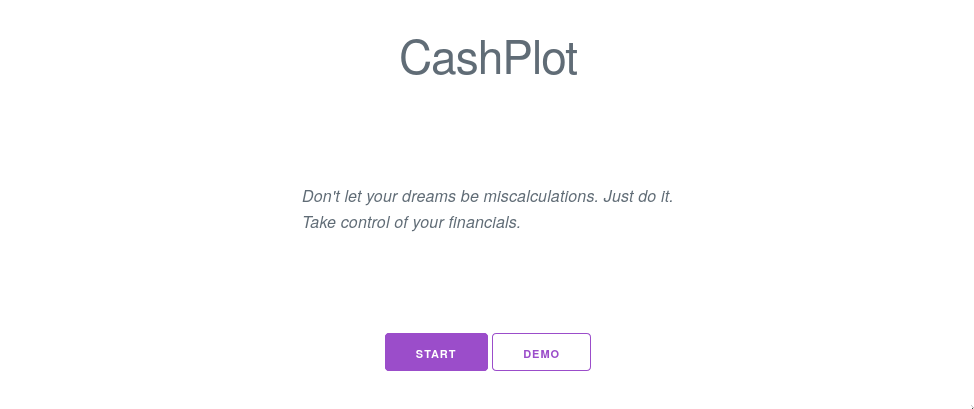
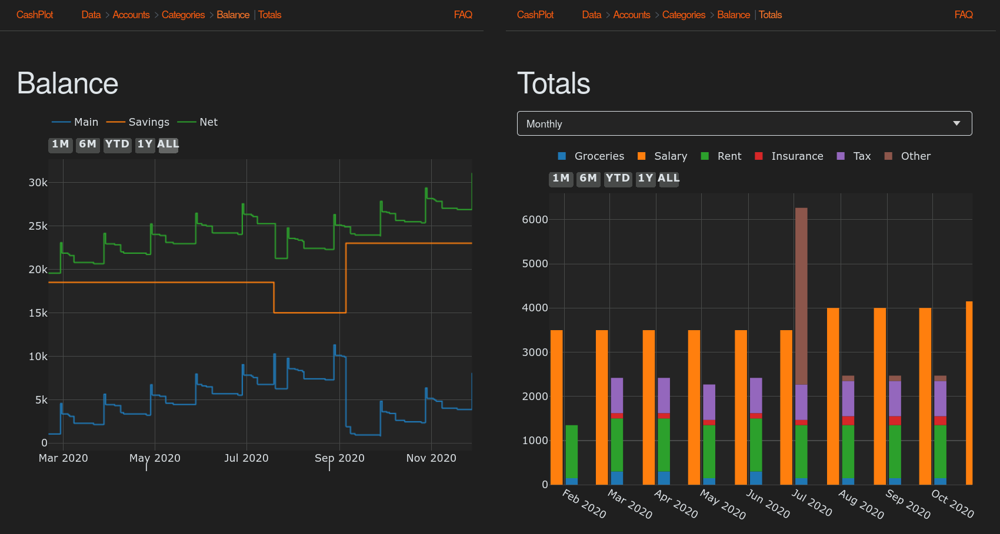

# CashPlot

  
  

CashPlot is a web application that helps in getting a grip on your financials.
It does so by showing your net worth over time and where your money is going
each month. This information can lead to profound insights, at least it did for
me.

CashPlot computes and stores everything locally in the browser, which means
that your data stays private.

At the moment, CashPlot only supports ING Bank exported transaction files. If
you use a bank that's unsupported, please let me know. I'd like to add support
for as many banks as possible.

## How to use

Go to the website linked above, or:

- Install [Node.JS](https://nodejs.org)
- Clone this repository
- `npm install`
- `npm run build`
- Open `./src/index.html` in your favorite browser

The user interface should be self-explanatory.

## Limitations

Take the graphs with a grain of salt; always carefully check before taking
conclusions.

Only one main (checking) account is supported. The balance of the
savings accounts is calculated by the transactions between the main and savings
accounts. If the savings accounts are modified by other sources (for example
interest), this won't get taken into account.

Transactions made on the same day can get reordered, which might result in a
negative balance on the graph when it did not happen in actuality.

## Development

CashPlot is a static website with a bundled JavaScript frontend. After making
a change, re-create the bundle with:  
`npm run build`

To re-create the bundle automatically every time a source file is changed:  
`npm run watch build`

To run the unit tests:  
`npm run test`

To lint and auto-format the source code:  
`npm run lint`

## Feedback

If you have any issues, questions, or suggestions on how CashPlot can be
improved, feel free to create an issue on GitHub or send me an email (see my
GitHub profile). All feedback is appreciated.

For adding support for a bank, please attach an example transaction file to
work against. Of course, you should replace personal information with something
else.
